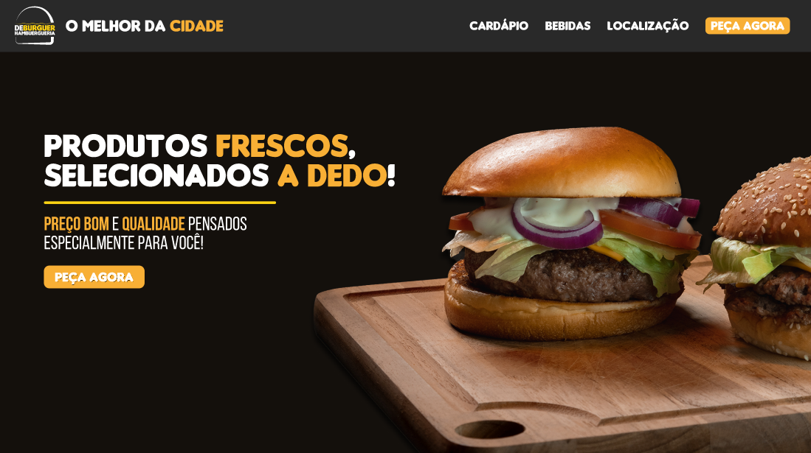

# Deburguer

Bem-vindo ao site do Deburguer, e veja a delícia dos hambúrgueres com um layout agradável.

ㅤ
ㅤ
## Demo

Você pode acessar o site do Deburguer [aqui](https://deburguer-shop.netlify.app/).

## Tecnologias Utilizadas

ㅤㅤ
ㅤ

## Descrição

O Deburguer é um site desenvolvido para apresentar uma seleção de hambúrgueres e bebidas, além de fornecer informações sobre a localização e como fazer pedidos. Desenvolvido com HTML5 e estilizado com CSS3, o Deburguer segue um layout responsivo e proporciona uma experiência usuário agradável de navegação com um design limpo, atrativo e intuitivo.

## Como rodar o projeto

1. Clone o repositório:

    ```bash
    git clone https://github.com/seuusuario/seurepositorio
    ```

2. Após clonar o projeto, abra no seu dispositivo local e copie o caminho do arquivo HTML.

3. E, depois, cole-o no seu navegador. Pronto!

## Contribuição

Contribuições são bem-vindas! Sinta-se à vontade para abrir uma issue ou enviar um pull request com melhorias, correções de bugs ou novos recursos.

---

### Explore o Mundo do Deburguer!

Desfrute da seleção de hambúrgueres e bebidas enquanto explora o site.